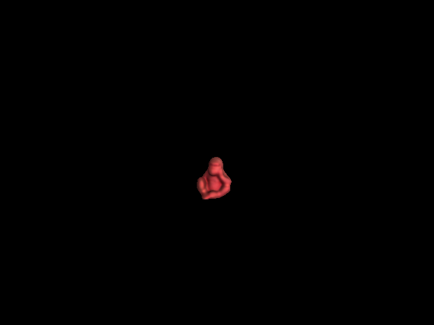
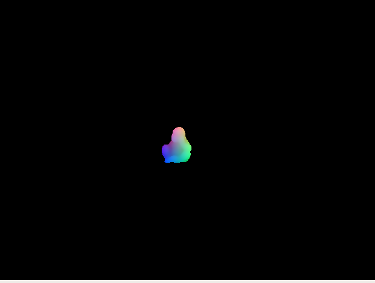

# Renders_for_6D
We provide some Renders to generate data for 6D pose estimation, including OpenGL, blender and so on.

## OpenGL_Render
### Installation
- Set up python environment from requirement.txt:
  ```shell
  sudo apt-get install libglfw3-dev libglfw3  
  pip install -r requirement.txt 
  sudo apt-get install libassimp-dev  
  pip install --pre --upgrade PyOpenGL PyOpenGL_accelerate
  pip install cython
  pip install cyglfw3
  pip install pyassimp==3.3
  pip install imgaug
  pip install progressbar
  ```


### how to use
-  just run the tools/creat_xyz.py, and set your intrinsic_matrix and CAD model

### Result
- generate the rgb image and xyz map for CDPN/Pix2Pose/GDRnet

<br/>
<br/>


